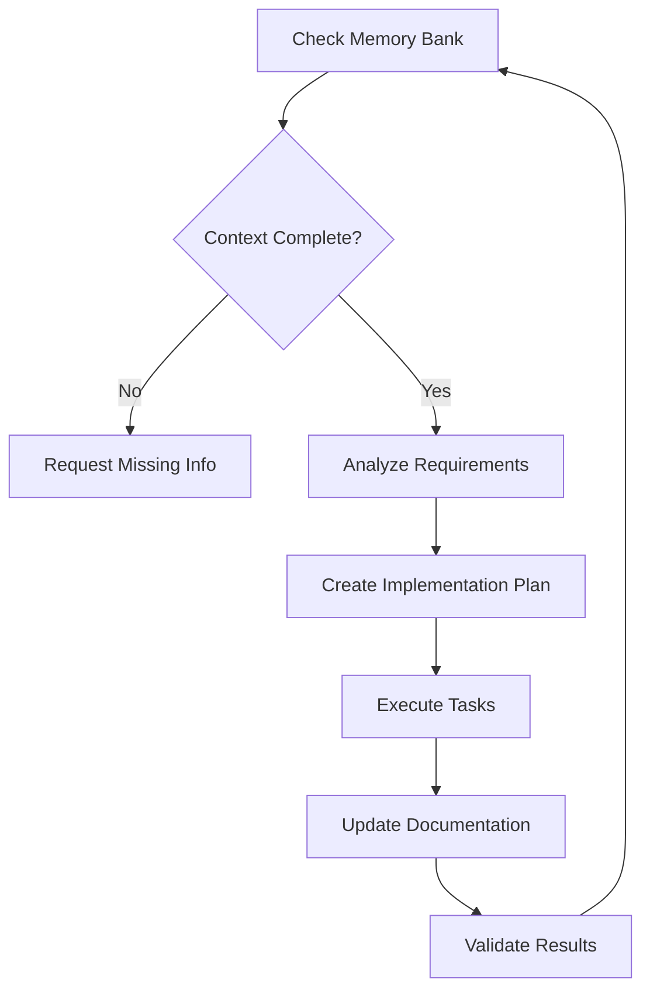

# Advanced AI Instruction Patterns

## Executive Summary

This document synthesizes advanced AI instruction patterns from leading coding assistants (Cline, Cursor, VS Code Copilot) and official prompt engineering guidelines from Anthropic and OpenAI. Focus is on production-ready, scalable instruction architectures.

## Core Architectural Patterns

### Hierarchical Instruction System

**Implementation**: Multi-layer instruction loading with clear precedence
```
1. Language Preferences (localization)
2. Global User Settings (custom instructions)
3. Global Rule Files (user-wide patterns)
4. Local Project Rules (.clinerules, .cursorrules)
5. Context-Specific Rules (file-type, task-specific)
6. Security Exclusions (.ignore patterns)
```

**Benefits**:
- Composable instruction layers
- Project vs user scope separation
- Version control integration
- Team collaboration support

### Memory Bank Architecture

**Core Files Structure**:
```
project-root/
├── memory-bank/
│   ├── project-brief.md          # Project purpose & requirements
│   ├── active-context.md         # Current state & next steps
│   ├── system-patterns.md        # Architecture decisions
│   ├── tech-context.md           # Technology stack & constraints
│   └── progress.md               # Status & completed work
```

**Implementation Guidelines**:
- Document EVERYTHING before memory resets
- Verify completeness before task execution
- Update context after significant changes
- Use `[MEMORY BANK: ACTIVE]` markers during operations

### Cross-Platform Compatibility Layer

**File Naming Conventions**:
- `.clinerules` - Cline-specific instructions
- `.cursorrules` - Cursor IDE compatibility  
- `.windsurfrules` - Windsurf editor support
- `.instructions.md` - VS Code contextual instructions

**Metadata Framework**:
```yaml
---
description: 'Instruction purpose'
applyTo: "**/*.tsx"     # File targeting patterns
mode: 'agent'           # Operational mode
tools: ['tool1', 'tool2'] # Tool restrictions
---
```

## Advanced Prompt Engineering Techniques

### Constraint Stuffing
Explicit constraints to prevent common AI issues:
```markdown
## Code Quality Constraints
- "DO NOT BE LAZY. DO NOT OMIT CODE."
- "ensure the code is complete"
- "always provide the full function definition"
- "include ALL parts of the file, even if unchanged"
```

### Confidence Verification
Build-in validation mechanisms:
```markdown
## Validation Patterns
- "On a scale of 1-10, how confident are you in this solution?"
- "List any assumptions you're making"
- "What could go wrong with this approach?"
```

### Challenge Framework
Encourage deeper analysis:
```markdown
## Critical Thinking Prompts
- "What alternative approaches exist?"
- "Challenge your initial assumptions"
- "What would an expert critique about this?"
```

## Security and Privacy Frameworks

### Sensitive File Protection
```markdown
## Security Exclusions
DO NOT read, modify, or reference:
- .env files and environment variables
- */config/secrets.* patterns
- Certificate files (*.pem, *.key, *.crt)
- API keys, tokens, credentials
- Database connection strings
- Authentication configurations

## Security Practices
- Use environment variables for secrets
- Never log sensitive information
- Validate input sanitization
- Implement least-privilege access
```

### Instruction Safety Protocol
```markdown
## Safety Guidelines
1. Human oversight required for:
   - Security-related instructions
   - Production deployment rules
   - Data handling procedures
   - External API configurations

2. Validation requirements:
   - Test instructions before deployment
   - Version control all instruction changes
   - Document instruction purpose and scope
   - Regular security review cycles
```

## Quality Assurance Patterns

### Code Completeness Framework
```markdown
## Code Quality Rules
- Always provide complete code implementations
- Include necessary imports and dependencies
- Add error handling and edge cases
- Provide comprehensive documentation
- Follow project coding standards
- Include relevant test cases

## Anti-Patterns to Avoid
- Partial code snippets without context
- "TODO" comments without implementation
- Missing error handling
- Hardcoded values without configuration
- Undocumented public interfaces
```

### Documentation Requirements
```markdown
## Documentation Standards
- Update relevant documentation with code changes
- Maintain changelog entries
- Keep README synchronized with capabilities
- Document architectural decisions (ADRs)
- Include usage examples and troubleshooting
- Provide migration guides for breaking changes
```

## Workflow Integration Patterns

### Plan-Act-Document Cycle


### Context Management Protocol
```markdown
## Context Lifecycle
1. **Initialization**: Verify memory bank completeness
2. **Planning**: Create detailed implementation strategy
3. **Execution**: Follow plan with progress tracking
4. **Documentation**: Update all relevant contexts
5. **Validation**: Confirm objectives met
6. **Persistence**: Save state for future sessions
```

## Tool Integration Frameworks

### MCP Server Rules
Context-aware tool selection patterns:
```markdown
## Tool Selection Matrix
- Database operations → sqlite-explorer, database-tools
- File operations → filesystem-server, file-manager
- Web browsing → browser-automation, web-tools
- API testing → http-client, api-tools
- Documentation → markdown-tools, docs-generator

## Activation Keywords
- "database", "sql", "query" → database tools
- "file", "directory", "path" → filesystem tools
- "browse", "web", "url" → browser tools
- "api", "request", "endpoint" → http tools
```

### Parallel Execution Preferences
```markdown
## Execution Optimization
- Run multiple searches in parallel when possible
- Use semantic search for context exploration
- Prefer tool chaining over repeated manual operations
- Batch similar operations for efficiency
- Cache frequently accessed information
```

## Implementation Guidelines

### Instruction File Structure
```markdown
## Template Structure
# Brief Overview
[Concise description of instruction purpose]

## Communication Style
- [Specific style preferences]
- [Response format requirements]

## Development Workflow  
- [Process and methodology preferences]
- [Tool usage guidelines]

## Coding Best Practices
- [Language-specific standards]
- [Architecture patterns]
- [Quality requirements]

## Project Context
- [Domain-specific information]
- [Business requirements]
- [Technical constraints]
```

### Testing and Validation
```markdown
## Instruction Testing Protocol
1. **Smoke Test**: Basic functionality verification
2. **Edge Case Testing**: Boundary condition handling
3. **Integration Testing**: Cross-component compatibility
4. **Performance Testing**: Response time and efficiency
5. **Security Testing**: Vulnerability assessment
6. **User Acceptance**: Real-world scenario validation
```

## Advanced Patterns

### Dynamic Instruction Adaptation
```markdown
## Context-Aware Rules
- Automatically adjust instruction complexity based on task scope
- Scale formality based on team vs personal project context
- Adapt security requirements based on data sensitivity
- Modify documentation depth based on project maturity
```

### Instruction Inheritance
```markdown
## Hierarchical Rule Systems
- Base instructions for general development practices
- Framework-specific overlays (React, Vue, Angular)
- Language-specific extensions (TypeScript, Python, Rust)
- Domain-specific specializations (web, mobile, ML, DevOps)
```

### Collaborative Patterns
```markdown
## Team Coordination
- Shared instruction repositories for team consistency
- Role-based instruction variations (junior, senior, architect)
- Project phase adaptations (prototype, development, production)
- Code review integration with instruction compliance
```

## Future Evolution

### Emerging Patterns
- **AI-to-AI Instructions**: Instructions for AI agents working together
- **Contextual Intelligence**: Instructions that adapt to current development context
- **Semantic Instruction Matching**: Automatic instruction selection based on task analysis
- **Instruction Performance Analytics**: Metrics-driven instruction optimization

### Integration Roadmap
1. **Phase 1**: Basic instruction frameworks and security patterns
2. **Phase 2**: Advanced workflow integration and team collaboration
3. **Phase 3**: Dynamic adaptation and contextual intelligence
4. **Phase 4**: Cross-platform standardization and ecosystem integration

---

*This document represents synthesis of production-ready patterns from Cline, VS Code Copilot, Cursor, and official AI company guidelines. Emphasis on security, scalability, and team collaboration.*
