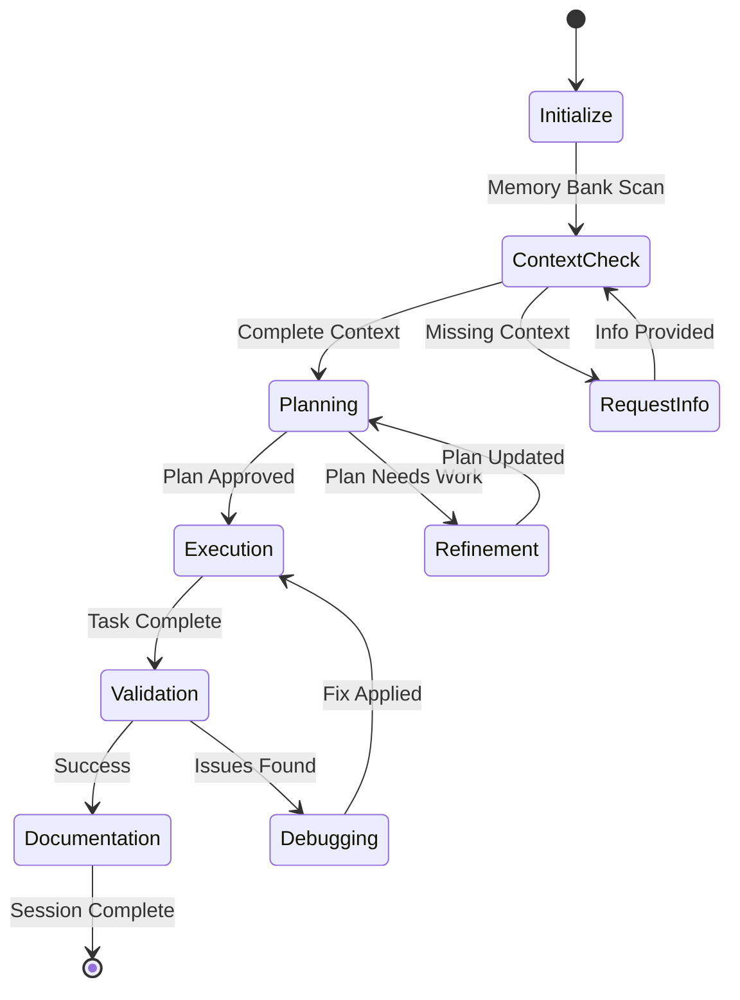

# Implementation Guide

Practical step-by-step guide for implementing effective AI instructions in real projects.

## Quick Start Implementation

### Step 1: Repository Setup (5 minutes)
1. Create `.github/copilot-instructions.md` in your repository
2. Define basic code standards and security requirements
3. Specify framework patterns and naming conventions
4. Include testing and quality requirements

**Template**:
```markdown
## Code Standards
- Use [language] with [version]+
- Run `[lint_command]` before commits
- Follow [framework] conventions
- Ensure tests pass with `[test_command]`

## Security Requirements  
- Environment variables for secrets
- Input validation for all user data
- Parameterized database queries
- Proper authentication patterns
```

### Step 2: Instruction Quality Setup (10 minutes)
1. Create instruction templates for common tasks
2. Define acceptance criteria patterns
3. Establish review checkpoints
4. Set up validation workflows

### Step 3: Agent Integration (15 minutes)
1. Configure agent mode in IDE
2. Set up coding agent permissions (if using Enterprise)
3. Test basic workflows with sample tasks
4. Validate instruction effectiveness

## Implementation Patterns

### Pattern 1: Feature Development Workflow

#### Phase 1: Specification (Agent Mode)
```markdown
**Task**: "Analyze our existing [system] and draft a specification for adding [feature]. 
Include API changes, database modifications, and UI updates. Reference our patterns 
in [existing_files]."

**Output**: Technical specification document
**Validation**: Review for completeness and feasibility
```

#### Phase 2: Implementation (Coding Agent)
```markdown
### Feature: [Feature Name]
**Specification**: [Link to spec document]
**Acceptance Criteria**:
- [ ] [Specific requirement 1]
- [ ] [Specific requirement 2]  
- [ ] All tests pass
- [ ] Documentation updated

assignees: Copilot
```

#### Phase 3: Polish (Combined)
- Agent mode for quick fixes and refinements
- Coding agent for systematic improvements and testing

### Pattern 2: Bug Fix Workflow

#### Investigation (Agent Mode)
```markdown
"The [component] is showing [specific_issue]. Analyze the code in [relevant_files], 
identify the root cause, and propose a fix that maintains [constraints]."
```

#### Implementation (Coding Agent Issue)
```markdown
### Bug: [Brief Description]
**Root Cause**: [Analysis from agent mode]
**Reproduction**: [Specific steps]
**Fix Requirements**:
- [ ] [Specific fix criterion]
- [ ] No regression in [areas]
- [ ] Tests cover the bug scenario
```

### Pattern 3: Refactoring Workflow

#### Analysis (Agent Mode)
```markdown
"Review [component/system] for refactoring opportunities. Focus on [aspects] 
while maintaining [compatibility_requirements]. Suggest specific improvements."
```

#### Implementation (Coding Agent)
```markdown
### Refactor: [Component Name]
**Goal**: [Specific improvement objective]
**Constraints**: [Compatibility and safety requirements]
**Success Criteria**:
- [ ] [Performance/maintainability goal]
- [ ] All existing tests pass
- [ ] API compatibility maintained
```

## Common Implementation Scenarios

### Scenario 1: New Project Setup
1. **Infrastructure Setup**: Use coding agent for boilerplate and configuration
2. **Architecture Design**: Use agent mode for interactive design decisions
3. **Initial Implementation**: Alternate between both based on task complexity
4. **Quality Integration**: Set up automated testing and review processes

### Scenario 2: Legacy System Enhancement
1. **System Analysis**: Use agent mode for exploration and understanding
2. **Incremental Changes**: Use coding agent for well-defined improvements
3. **Integration Testing**: Use agent mode for complex integration scenarios
4. **Documentation Updates**: Use coding agent for systematic documentation

### Scenario 3: Team Collaboration
1. **Standard Setting**: Create shared instruction templates and guidelines
2. **Review Integration**: Include instruction quality in code review process
3. **Knowledge Sharing**: Document successful patterns for team reuse
4. **Continuous Improvement**: Regular review and refinement of instruction patterns

## Quality Assurance Implementation

### Automated Quality Checks
```yaml
# .github/workflows/instruction-quality.yml
name: Instruction Quality Check
on: [pull_request]
jobs:
  quality-check:
    runs-on: ubuntu-latest
    steps:
      - name: Check instruction specificity
        run: |
          # Validate instructions meet specificity requirements
          # Check for vague language patterns
          # Ensure context is provided
      
      - name: Validate acceptance criteria
        run: |
          # Verify measurable success criteria exist
          # Check for security considerations
          # Validate testing requirements
```

### Manual Quality Gates
1. **Pre-Implementation Review**:
   - Instruction clarity and specificity
   - Context completeness and relevance
   - Security and safety considerations

2. **Post-Implementation Review**:
   - Results match specified outcomes
   - Quality standards maintained
   - No unintended side effects

### Continuous Monitoring
```markdown
## Weekly Review Checklist
- [ ] Review instruction effectiveness metrics
- [ ] Identify patterns in successful/failed instructions
- [ ] Update templates based on learnings
- [ ] Share insights with team
- [ ] Plan improvements for next iteration
```

## Tool Integration Strategies

### IDE Integration
1. **Custom Instructions**: Configure per-repository settings
2. **Template Libraries**: Create reusable instruction snippets
3. **Quality Helpers**: Set up validation and checking tools
4. **Review Integration**: Include instruction review in development workflow

### GitHub Integration
1. **Issue Templates**: Create templates for coding agent tasks
2. **PR Templates**: Include instruction quality checklist
3. **Action Workflows**: Automate instruction validation
4. **Documentation Integration**: Link instructions to relevant documentation

### Team Collaboration Tools
1. **Instruction Libraries**: Shared repositories of effective instructions
2. **Best Practice Sharing**: Regular team reviews of instruction patterns
3. **Training Materials**: Documentation and examples for new team members
4. **Success Metrics**: Track and share instruction effectiveness data

## Troubleshooting Common Issues

### Issue 1: Inconsistent Results
**Symptoms**: Same instruction produces different outcomes
**Solutions**:
- Add more specific context and constraints
- Include examples of expected behavior
- Break down into smaller, atomic tasks
- Validate instruction clarity with team review

### Issue 2: Poor Quality Output
**Symptoms**: Results don't meet standards or expectations
**Solutions**:
- Review and enhance quality requirements in instructions
- Add specific testing and validation criteria
- Include security and performance requirements
- Implement automated quality checks

### Issue 3: Scope Creep
**Symptoms**: Instructions result in more changes than intended
**Solutions**:
- Make task boundaries more explicit
- Use atomic task design principles
- Add specific constraints and limitations
- Include "do not change" requirements for stable components

### Issue 4: Security or Safety Issues
**Symptoms**: Generated code introduces vulnerabilities or risks
**Solutions**:
- Always include security requirements in instructions
- Add explicit safety validation criteria
- Implement automated security scanning
- Require security review for sensitive changes

## Scaling Strategies

### Individual Developer
1. Start with personal instruction templates
2. Build library of effective patterns
3. Track what works and what doesn't
4. Gradually increase complexity and sophistication

### Team Implementation
1. Establish shared instruction standards
2. Create team-specific templates and patterns
3. Implement review and quality processes
4. Regular training and knowledge sharing

### Organization-Wide Adoption
1. Develop organizational instruction policies
2. Create training programs and documentation
3. Implement governance and compliance frameworks
4. Establish metrics and continuous improvement processes

## Success Metrics and KPIs

### Effectiveness Metrics
- Percentage of instructions that produce acceptable results on first attempt
- Time saved compared to manual implementation
- Reduction in bugs and quality issues
- Improvement in code consistency and standards compliance

### Quality Metrics
- Security vulnerability reduction
- Test coverage improvement
- Documentation completeness
- Code review efficiency

### Process Metrics
- Instruction creation and refinement time
- Developer satisfaction with AI assistance
- Knowledge sharing and template reuse rates
- Continuous improvement adoption rates

## Advanced Implementation Patterns

### Cline Memory Bank System Implementation

**Technical Architecture**:
```typescript
// System prompt integration hierarchy
export function addUserInstructions(
    settingsCustomInstructions?: string,      // Global user preferences
    globalClineRulesFileInstructions?: string, // User-wide rule files  
    localClineRulesFileInstructions?: string,  // Project .clinerules
    localCursorRulesFileInstructions?: string, // Cross-platform compatibility
    localWindsurfRulesFileInstructions?: string,
    clineIgnoreInstructions?: string,         // Security exclusions
    preferredLanguageInstructions?: string    // Localization
) {
    // Hierarchical instruction merging with precedence rules
}
```

**Memory Bank Workflow Implementation**:
```markdown
## Memory Bank Operational Protocol

### Core Workflow States
1. **[MEMORY BANK: INITIALIZE]** - Setup phase with context validation
2. **[MEMORY BANK: ACTIVE]** - Normal operation with context tracking  
3. **[MEMORY BANK: UPDATE]** - Documentation refresh before memory reset
4. **[MEMORY BANK: VALIDATE]** - Context completeness verification

### File Structure Requirements
```
project-root/
├── memory-bank/
│   ├── project-brief.md          # Static: Project purpose & requirements
│   ├── active-context.md         # Dynamic: Current state & immediate next steps
│   ├── system-patterns.md        # Semi-static: Architecture & design decisions
│   ├── tech-context.md           # Semi-static: Stack, tools, constraints
│   ├── progress.md               # Dynamic: Completion status & remaining work
│   └── context-specific/         # Optional: Feature docs, API specs, etc.
```

### Context Validation Rules
- Check ALL required files exist before proceeding
- Verify activeContext.md reflects current development state
- Confirm progress.md accuracy before major transitions
- Update systemPatterns.md when architectural decisions change
```

### Advanced Prompt Engineering Implementation

**Constraint Enforcement Framework**:
```markdown
## Code Quality Enforcement Implementation

### Anti-Truncation Patterns
- "CRITICAL: Provide complete implementations without omissions"
- "VERIFY: Include all necessary imports, types, and dependencies"  
- "VALIDATE: Ensure error handling and edge cases covered"
- "DOCUMENT: Add comprehensive inline documentation"

### Confidence Validation Protocol
```typescript
interface ConfidenceCheck {
    confidenceLevel: 1-10;
    assumptions: string[];
    risksIdentified: string[];
    alternativeApproaches: string[];
    testingStrategy: string;
}
```

### Progressive Enhancement Strategy
1. **Basic Implementation**: Core functionality with minimal dependencies
2. **Robustness Layer**: Error handling, validation, logging
3. **Performance Optimization**: Caching, lazy loading, efficient algorithms
4. **Security Hardening**: Input validation, access controls, audit trails
5. **Maintainability**: Documentation, tests, monitoring
```

### Cross-Platform Instruction System

**File Recognition Matrix**:
```markdown
## Multi-Editor Compatibility Implementation

### File Type Mapping
- `.clinerules` → Cline native format
- `.cursorrules` → Cursor IDE compatibility
- `.windsurfrules` → Windsurf editor support  
- `.instructions.md` → VS Code contextual instructions
- `.prompt.md` → Reusable prompt templates
- `.mode.md` → Operational mode definitions

### Metadata Schema Implementation
```yaml
---
# Core metadata
description: 'Instruction purpose and scope'
version: '1.0.0'
author: 'team@company.com'

# Targeting rules
applyTo: "**/*.{ts,tsx,js,jsx}"    # File pattern matching
excludeFrom: "**/node_modules/**"  # Exclusion patterns
mode: 'agent'                      # Operation mode: agent|chat|inline

# Tool configuration  
tools: ['filesystem', 'browser']   # Allowed tool restrictions
mcpServers: ['sqlite', 'web']      # MCP server preferences

# Context requirements
requiredContext: ['project-brief', 'tech-stack']
optionalContext: ['api-docs', 'design-system']

# Quality settings
confidenceThreshold: 8            # Minimum confidence level
validationRequired: true          # Require human validation
securityLevel: 'standard'         # Security classification
---
```

### Security Framework Implementation

**Comprehensive Security Layer**:
```markdown
## Production Security Implementation

### Sensitive Pattern Detection
```typescript
const SENSITIVE_PATTERNS = [
    /\.env(\.|$)/,                    // Environment files
    /.*secret.*\.(json|yaml|yml)$/,   // Secret configuration
    /.*key.*\.(pem|p12|pfx)$/,        // Certificate files
    /(password|token|key|secret)/i,   // Credential keywords
    /api[_-]?key/i,                   // API key patterns
    /connection[_-]?string/i          // Database connections
];

const SECURITY_RULES = {
    never_read: SENSITIVE_PATTERNS,
    never_log: ['password', 'token', 'secret', 'key'],
    require_env_vars: ['DB_URL', 'API_KEYS', 'SECRETS'],
    validate_input: ['user_data', 'external_apis', 'file_uploads']
};
```

### Access Control Framework
```markdown
## Instruction Access Control

### Permission Levels
1. **READ_ONLY**: Can analyze code, suggest improvements
2. **MODIFY_SAFE**: Can edit non-sensitive application code  
3. **MODIFY_CONFIG**: Can update configuration files
4. **MODIFY_SECURITY**: Can change security-related settings
5. **ADMIN_FULL**: Complete system access (requires human approval)

### Context-Based Restrictions
- Development environment: MODIFY_SAFE + MODIFY_CONFIG
- Staging environment: READ_ONLY + human approval for changes
- Production environment: READ_ONLY only, emergency exceptions
```

### Quality Assurance System Implementation

**Automated Quality Gates**:
```markdown
## Quality Enforcement Implementation

### Pre-Execution Validation
```typescript
interface QualityChecks {
    syntax: boolean;           // Code syntax validation
    security: boolean;         // Security pattern scanning  
    performance: boolean;      // Performance impact analysis
    documentation: boolean;    // Documentation completeness
    testing: boolean;          // Test coverage requirements
    dependencies: boolean;     // Dependency security audit
}

const QUALITY_GATES = {
    minimum_confidence: 8,
    required_documentation: ['README', 'API_DOCS', 'CHANGELOG'],
    security_scan_required: true,
    performance_benchmark: true,
    human_review_threshold: 'high_impact_changes'
};
```

### Progressive Quality Enhancement
```markdown
## Quality Maturity Levels

### Level 1: Basic Functionality
- Code compiles/runs without errors
- Basic error handling implemented
- Minimal documentation present

### Level 2: Production Ready  
- Comprehensive error handling
- Input validation and sanitization
- Complete documentation
- Basic test coverage (>70%)

### Level 3: Enterprise Grade
- Advanced security measures
- Performance optimization
- Comprehensive test suite (>90%)
- Monitoring and observability
- Disaster recovery procedures

### Level 4: Industry Leading
- Zero-trust security architecture
- AI-assisted quality monitoring
- Automated optimization
- Predictive maintenance
- Continuous improvement loops
```

### Workflow Integration Patterns

**Advanced State Management**:


**Context Persistence Strategy**:
```markdown
## Context Management Implementation

### State Serialization
```typescript
interface SessionState {
    memoryBank: {
        projectBrief: string;
        activeContext: string;
        systemPatterns: string;
        techContext: string;
        progress: string;
    };
    currentTask: {
        description: string;
        status: 'planning' | 'executing' | 'validating' | 'documenting';
        steps: TaskStep[];
        blockers: string[];
    };
    qualityMetrics: {
        confidence: number;
        completeness: number;
        securityScore: number;
        performanceImpact: 'low' | 'medium' | 'high';
    };
}
```

### Continuous Context Validation
```markdown
## Context Integrity Monitoring

### Validation Checkpoints
1. **Pre-task**: Verify memory bank completeness
2. **Mid-task**: Confirm current context accuracy  
3. **Post-task**: Update documentation and progress
4. **Session-end**: Validate state for future sessions
5. **Emergency**: Force context save on unexpected termination

### Recovery Procedures
- Automatic context backup every N operations
- Change detection and incremental saves
- Conflict resolution for concurrent modifications
- Rollback capabilities for corrupted state
```

### Tool Integration Framework

**MCP Server Selection Logic**:
```typescript
interface MCPSelectionRules {
    contextKeywords: {
        database: ['sqlite-explorer', 'postgres-client'];
        filesystem: ['file-manager', 'directory-tools'];
        web: ['browser-automation', 'web-scraper'];
        api: ['http-client', 'api-tester'];
        documentation: ['markdown-tools', 'docs-generator'];
    };
    
    taskPatterns: {
        '/analyze.*database/i': 'sqlite-explorer';
        '/browse.*web/i': 'browser-automation';
        '/test.*api/i': 'http-client';
        '/generate.*docs/i': 'docs-generator';
    };
    
    fallbackStrategy: 'ask-user' | 'use-default' | 'suggest-alternatives';
}
```

**Performance Optimization Patterns**:
```markdown
## Execution Optimization Implementation

### Parallel Processing Rules
- Run independent searches concurrently
- Batch similar file operations
- Cache frequently accessed data
- Use semantic search for exploration
- Prefer tool chaining over repetitive operations

### Resource Management
```typescript
interface ResourceLimits {
    maxConcurrentOperations: 5;
    cacheSize: '100MB';
    timeoutThresholds: {
        search: '30s';
        fileOperation: '10s';
        webRequest: '60s';
        llmQuery: '45s';
    };
    rateLimits: {
        apiCalls: '100/minute';
        fileWrites: '50/minute';
        searches: '200/minute';
    };
}
```
